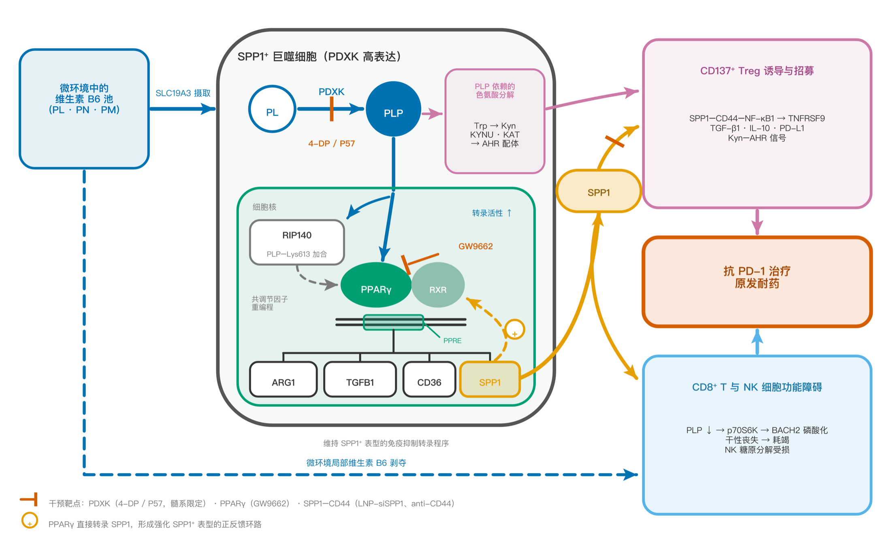
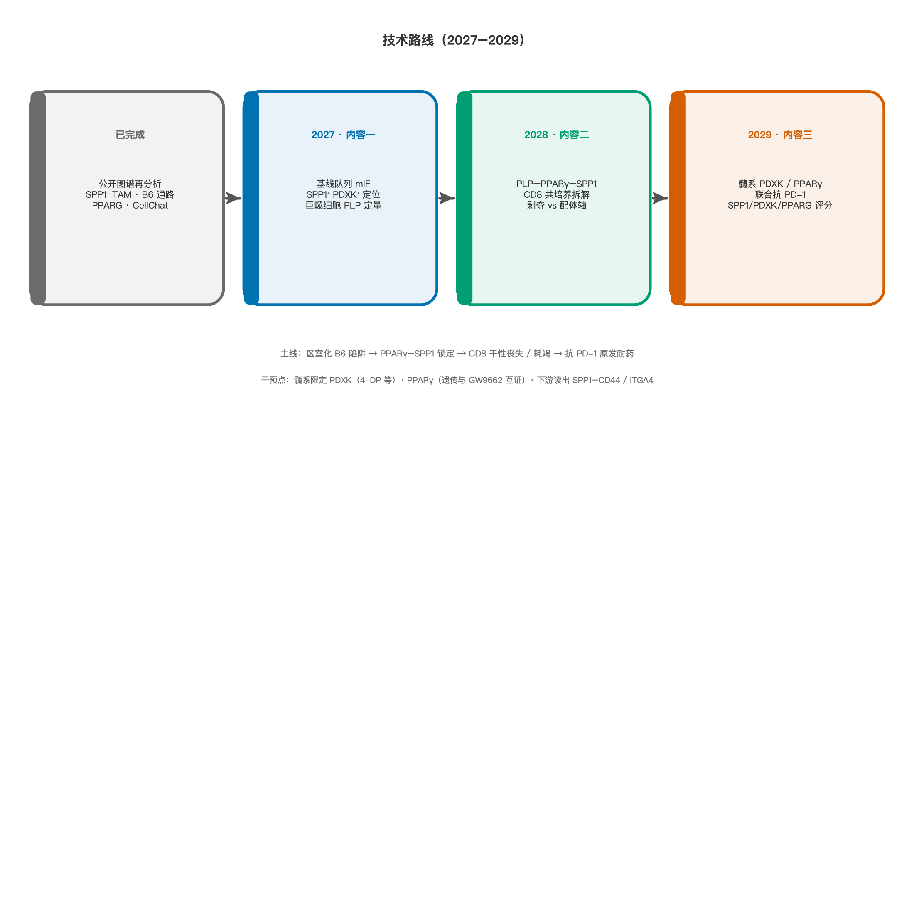

# 泰山学者青年专家工作计划书

**拟申报题目：** 维生素B6区室化代谢重编程驱动SPP1⁺巨噬细胞介导非小细胞肺癌免疫治疗原发耐药的机制研究

**所属学科领域：** 基础医学（免疫学 / 肿瘤学）— 肿瘤免疫代谢

**计划执行期：** 2027–2029 年

> 填报说明：文中 `[待填]` 须在上传前替换为申请人真实信息。灰色方括号内文字为内部提示，提交时删除。

---

## 1、研究内容及所属研究领域

本项目属于**肿瘤免疫代谢**方向，面向非小细胞肺癌（non-small cell lung cancer, NSCLC）免疫检查点抑制剂（immune checkpoint inhibitor, ICI）原发耐药这一临床难题。研究对象是肿瘤相关巨噬细胞中高度保守、与免疫抑制密切相关的 **SPP1⁺ 亚群**。拟回答的核心问题不是“SPP1⁺ 巨噬细胞是否与耐药相关”（该关联已有单细胞与空间组学证据），而是：**这群细胞如何通过维生素B6（vitamin B6）的区室化代谢重编程建立并自我维持免疫抑制表型，进而经代谢剥夺与 SPP1–CD44 / SPP1–ITGA4 配体轴双重打击 CD8⁺ 耗竭性 T 细胞（CD8-Tex），导致抗 PD-1/PD-L1 治疗原发耐药。**

支持期内拟完成三块相互衔接的工作：（1）在独立的 NSCLC 免疫治疗队列中，于细胞与代谢物层面验证 SPP1⁺PDXK⁺ 巨噬细胞、局部磷酸吡哆醛（pyridoxal 5′-phosphate, PLP）梯度与疗效的关系；（2）解析 PLP 增强过氧化物酶体增殖物激活受体γ（PPARγ, 基因名 *PPARG*）转录输出、PPARγ 直接驱动 *SPP1* 的正反馈环路，并拆解“B6 局部剥夺”与“SPP1 配体轴”对 CD8⁺ T 细胞干性/耗竭的相对贡献；（3）在肺癌小鼠模型中实施髓系限定性吡哆醛激酶（pyridoxal kinase, PDXK）或 PPARγ 干预，检验其与抗 PD-1 的协同，并建立可转化的联合评分。

该方向同时对应山东省肺癌高疾病负担与“健康山东”、医养健康产业对原创靶点和疗效预测标志物的需求，属于基础研究向临床决策工具延伸的交叉领域。

---

## 2、研究意义、国内外研究现状及发展动态分析

（需结合科学研究发展趋势论述科学意义，并结合国民经济和社会发展中迫切需要解决的关键科技问题论述应用前景。）

### （一）科学意义与应用前景

肺癌是山东省疾病负担最重的恶性肿瘤之一。基于山东省肿瘤登记的分析显示，2018 年肺癌年龄标化发病率（42.56/10万）高于全国同期水平（38.23/10万）；预测至 2030 年标化发病率将升至 49.21/10万，女性与城镇人群上升更为明显[1]。抗 PD-1/PD-L1 抗体单药或联合化疗已成为晚期 NSCLC 的一线选择，但获益远非全体患者：KEYNOTE-024 中，PD-L1 高表达人群帕博利珠单抗客观缓解率约 44.8%[2]；KEYNOTE-189 中，帕博利珠单抗联合化疗的客观缓解率为 47.6%[3]。换言之，即便在当前标准方案下，仍有约半数患者无法获得客观缓解。原发耐药机制不清，导致临床只能依赖 PD-L1、肿瘤突变负荷等有限指标进行粗分，缺乏可干预的细胞–代谢靶点。

近年肿瘤免疫学的前沿已从“有没有 T 细胞浸润”推进到**髓系细胞如何把效应细胞锁在耗竭态**，又进一步推进到**微量营养素在不同免疫细胞之间的区室化分配**。维生素B6 活性形式 PLP 是百余种酶的辅因子，却也开始被识别为免疫细胞命运的信号分子。若能证明 NSCLC 中 SPP1⁺ 巨噬细胞通过“代谢陷阱”把 B6 从 CD8⁺ T 细胞手中夺走，并借 PPARγ–SPP1 正反馈把自身表型锁死，则科学上可把“巨噬细胞亚群”“核受体转录程序”“微量营养素竞争”三条原本平行的线索收束为一条可实验、可干预的因果链；应用上可导向**髓系限定性代谢干预联合 ICI**，以及 **SPP1/PDXK/PPARG 联合评分**，服务于我省胸部肿瘤中心的疗效分层与后续新药苗头筛选。

### （二）国内外研究现状

**（1）SPP1⁺ 巨噬细胞是跨癌种保守的免疫抑制亚群，在 NSCLC 中与免疫治疗不良结局相关，但上游驱动力不明。** Cheng 等构建的泛癌肿瘤浸润髓系细胞单细胞图谱已将 SPP1⁺ 肿瘤相关巨噬细胞（tumor-associated macrophage, TAM）识别为高度保守的促瘤亚群[4]。在 NSCLC，Xiao 等整合多个队列的单细胞与空间转录组，显示 SPP1 是肿瘤相对癌旁最显著的差异基因之一，SPP1⁺ 巨噬细胞与 FAP⁺ 成纤维细胞相互作用形成免疫排斥屏障，巨噬细胞特异性敲除 *Spp1* 可增加 CD8⁺ T 细胞浸润并抑制皮下瘤生长，FAP 与 SPP1 双高与免疫治疗预后不良相关[5]。Zhu 等进一步报道 TAM 经 SPP1–CD44、NECTIN2–TIGIT 等配体–受体对与 T 细胞对话，SPP1 过表达上调 PDCD1、CD160 等耗竭相关分子[6]。Zhang 等在 NSCLC 免疫治疗队列中证明 M2 样巨噬细胞经 SPP1–CD44 通路推动 CD8⁺CD101⁺TIM3⁺ 耗竭分化，阻断该轴可增强抗 PD-1 疗效[7]。上述工作把 **SPP1⁺ 巨噬细胞—CD8 耗竭—ICI 耐药** 的表型链条基本立住，但没有回答：这群细胞的转录程序如何被代谢状态锁定，因而一旦形成就难以逆转。

**（2）维生素B6 对淋巴细胞抗肿瘤功能总体有利，与“SPP1⁺ 巨噬细胞 B6 代谢旺盛”的观察形成必须正面处理的方向性矛盾。** Bargiela 等较早提出 B6 代谢影响 T 细胞抗肿瘤应答[8]。He 等在胰腺癌模型中证明肿瘤细胞大量消耗 B6 以支持一碳代谢，造成微环境 B6 剥夺并损害 NK 细胞糖原分解与杀伤功能[9]。Wu 等 2025 年底发表于 *Developmental Cell* 的工作给出目前最直接的 T 细胞机制：给予维生素B6 或其活性形式 PLP，可赋予小鼠和人 CD8⁺ T 细胞更强的持久性、干性样表型与清瘤能力；PDXK 杂合降低 PLP 则干性下降、耗竭表型增加；PLP 直接结合并抑制 p70S6K，减少 BACH2 的 S520 磷酸化，促进 BACH2 核滞留，从而维持干性基因、抑制耗竭基因，并在临床前模型中增强抗 PD-1 疗效[10]。与此同时，Galluzzi 等较早报道 NSCLC 中 PDXK 高表达与较好预后相关[11]——若把“B6 代谢”在全组织层面一律理解为促免疫抑制，将与该预后方向冲突。合理的解释是：**B6/PLP 的生物学后果取决于它落在哪一类细胞里。** 肿瘤细胞或 SPP1⁺ 巨噬细胞把 B6 截留为 PLP，T/NK 细胞则因缺乏 PLP 而失去功能。这正是本项目提出“区室化代谢陷阱”的文献根据，而不是把“补 B6”与“抑制巨噬细胞 B6 代谢”混为一谈。

**（3）PPARγ 是巨噬细胞替代活化程序的主控因子，并且可以直接转录 *SPP1*；PLP 具备增强 PPARγ 转录输出的生物化学先例。** Dai 等在脂质相关巨噬细胞中用 ChIP-qPCR 定位到 *SPP1* 启动子上的 PPARγ 结合位点，敲低 PPARγ 后 SPP1 表达显著下降，提出 CD36–PPARγ–SPP1 轴[12]。该证据来自代谢相关脂肪性肝病而非肺癌，不能直接外推，但为“PPARγ 转录 SPP1”提供了可检验的分子模板。Yanaka 等证明 PLP 可诱导 PPARγ 靶基因（如 *aP2*、*Gyk*）表达[13]；Moreno-Navarrete 等发现 PPARγ 激动剂可上调脂肪组织 PDXK，提示二者存在前馈[14]；Huq 等则显示 PLP 可与核受体共抑制因子 RIP140 的 Lys613 形成席夫碱加合，改变其核内滞留与阻遏活性[15]。综合来看，PLP 更适合被表述为 **PPARγ 转录输出的内源性调节因子**，而不是亲和力可与噻唑烷二酮类相比的经典配体。这一分寸是本项目机制表述的底线。

**（4）结直肠癌中已出现 SPP1⁺ TAM 维生素B6 代谢升高的转录组观察，本项目必须主动划界。** Xue 等整合结直肠癌单细胞与空间转录组，报告 SPP1⁺ TAM 与 SLC6A20⁺ 上皮细胞均显示糖酵解、维生素B6 代谢等通路升高，并据此做预后建模[16]。该文的本质是跨数据集的通路推断，没有 PLP 定量，没有 PDXK 因果干预，也不是 NSCLC 免疫治疗场景。本项目若仍把“KEGG 富集到维生素B6 代谢”当作主要创新，将被认为增量不足。创新必须前移到：**代谢物层面的区室化证据、PPARγ–SPP1 环路在肺癌巨噬细胞中的验证、以及对 CD8 干性的因果拆解。**

### （三）发展动态与本项目切入点

2025 年 Liu 等在 *Cell* 发表抗 PD-1 新辅助治疗后 NSCLC 免疫微环境单细胞/TCR 图谱（234 例手术标本；数据：GEO GSE243013，GSA HRA005191），将微环境分为与主要病理缓解率相关的若干亚型，无缓解者中耗竭相关 T 细胞与 CCR8⁺ Treg 等特征更突出[17]。该资源使“在真实免疫治疗背景下重注释髓系亚群”成为可能。申请人课题组基于这一公开数据源（及配套临床标注）进行再分析，观察到：**免疫治疗敏感者（R）肿瘤内 SPP1⁺ 巨噬细胞比例低于不敏感者（NR）；该亚群 KEGG 维生素B6 代谢通路活跃，SCENIC 预测 PPARG 活性升高；CellChat 显示其与 CD8-Tex 的优势互作对为 SPP1–CD44 与 SPP1–ITGA4。** 这一组学发现与上节文献链条咬合，但本身仍是相关。本项目的切入点，就是把相关提升为**区室化代谢因果**：SPP1⁺ 巨噬细胞高表达 PDXK（及 B6 转运体），将摄取的 B6 磷酸化为带电、不易自由扩散的 PLP，形成“代谢陷阱”——胞内 PLP 蓄积增强 PPARγ 活性并转录 *SPP1*，完成表型自我强化；微环境局部 B6 被剥夺后，CD8⁺ T 细胞按 Wu 等所揭示的 p70S6K–BACH2 路径丢失干性；同时 SPP1 通过 CD44/ITGA4 从配体层面叠加耗竭信号。两条路径独立可测、可干预，避免把机制押在单一结合常数上。

需要事先说清的限度：Liu 等图谱为**新辅助治疗后**标本，SPP1⁺ 巨噬细胞富集既可能是原发微环境特征，也可能部分反映治疗重塑。因此本项目第一年即以独立的基线/治疗前标本做空间与蛋白水平验证，避免把治疗后图谱的再分析直接当作原发耐药的最终证据。

**科学问题凝练：** SPP1⁺ 巨噬细胞能否通过维生素B6 的区室化代谢陷阱，经 PPARγ–SPP1 正反馈锁定自身表型，并经“PLP 剥夺 + SPP1 配体轴”双重诱导 CD8⁺ T 细胞耗竭，从而造成 NSCLC 抗 PD-1/PD-L1 原发耐药？若能，髓系限定干预 PDXK 或 PPARγ 是否可在不依赖全身大剂量补 B6 的前提下恢复 ICI 敏感性？

{width=100%}

**图1　本项目机制假说（区室化维生素B6 代谢陷阱）。** SPP1⁺ 巨噬细胞经 SLC19 家族摄取维生素B6，由 PDXK 转化为不易外流的 PLP，形成胞内蓄积、微环境局部剥夺。胞内 PLP 增强 PPARγ 转录输出并驱动 *SPP1* 等免疫抑制基因，构成正反馈；局部 B6 剥夺使 CD8⁺ T 细胞经 p70S6K–BACH2 路径丢失干性。图右侧 Treg / 犬尿氨酸–AHR 为文献支持的并行出口，本计划书主线为 CD8 双重打击（代谢剥夺 + SPP1–CD44 / ITGA4），不依赖 Treg 支路即可闭合。干预点：髓系限定 PDXK（4-DP 等）、PPARγ（遗传证据与 GW9662 互证）。

---

### 主要参考文献

1. Jiang F, Fu Z, Chu J, et al. Lung cancer incidence and mortality in trend and prediction between 2012-2030 in Shandong Province, using a Bayesian age-period-cohort model. *Front Oncol*. 2024;14:1451589. PMID: 39697222. DOI: 10.3389/fonc.2024.1451589  
2. Reck M, Rodríguez-Abreu D, Robinson AG, et al. Pembrolizumab versus Chemotherapy for PD-L1-Positive Non-Small-Cell Lung Cancer. *N Engl J Med*. 2016. PMID: 27718847. DOI: 10.1056/NEJMoa1606774  
3. Gandhi L, Rodríguez-Abreu D, Gadgeel S, et al. Pembrolizumab plus Chemotherapy in Metastatic Non-Small-Cell Lung Cancer. *N Engl J Med*. 2018;378(22):2078-2092. PMID: 29658856. DOI: 10.1056/NEJMoa1801005  
4. Cheng S, Li Z, Gao R, et al. A pan-cancer single-cell transcriptional atlas of tumor infiltrating myeloid cells. *Cell*. 2021;184(3):792-809.e23. PMID: 33545035. DOI: 10.1016/j.cell.2021.01.010  
5. Xiao M, Deng Y, Guo H, et al. Single-cell and spatial transcriptomics profile the interaction of SPP1+ macrophages and FAP+ fibroblasts in non-small cell lung cancer. *Transl Lung Cancer Res*. 2025;14(7):2646-2669. PMID: 40799444. DOI: 10.21037/tlcr-2025-244  
6. Zhu P, Liu Z, Husain H, et al. Single-cell and spatial analysis reveals macrophage-T cell crosstalk in non-small cell lung cancer immunosuppression. *Transl Lung Cancer Res*. 2025;14(9):4002-4020. PMID: 41132964. DOI: 10.21037/tlcr-2025-912  
7. Zhang G, Wu Y, Qi D, et al. M2 macrophages modulate the differentiation of CD8+ CD101−TIM3+ T cells via the SPP1–CD44 pathway, influencing the immunotherapeutic response in NSCLC. *J Transl Med*. 2026;24(1):134. PMID: 41495843. DOI: 10.1186/s12967-025-07662-1  
8. Bargiela D, Cunha PP, Veliça P, et al. Vitamin B6 Metabolism Determines T Cell Anti-Tumor Responses. *Front Immunol*. 2022;13:837669. PMID: 35251031. DOI: 10.3389/fimmu.2022.837669  
9. He C, Wang D, Shukla SK, et al. Vitamin B6 Competition in the Tumor Microenvironment Hampers Antitumor Functions of NK Cells. *Cancer Discov*. 2024;14(1):176-193. PMID: 37931287. DOI: 10.1158/2159-8290.CD-23-0334  
10. Wu J, Li G, Zhou J, et al. Vitamin B6 preserves the stemness-like phenotypes and antitumor ability of CD8+ T cells. *Dev Cell*. 2026;61(3):589-604.e7. PMID: 41314217. DOI: 10.1016/j.devcel.2025.10.017  
11. Galluzzi L, et al. Prognostic impact of vitamin B6 metabolism in lung cancer. *Cell Rep*. 2012. PMID: 22854025. DOI: 10.1016/j.celrep.2012.06.017  
12. Dai Z, Liu X, Liang Y, et al. CD36–PPARγ–SPP1 axis mediates hepatocyte-macrophage coordination to drive MASLD-related liver fibrosis. *JHEP Rep*. 2026;8(4):101745. PMID: 41810434. DOI: 10.1016/j.jhepr.2026.101745  
13. Yanaka N, Kanda M, Toya K, et al. Vitamin B6 regulates mRNA expression of peroxisome proliferator-activated receptor-γ target genes. *Exp Ther Med*. 2011;2(3):419-424. PMID: 22977520. DOI: 10.3892/etm.2011.238  
14. Moreno-Navarrete JM, Jové M, Ortega F, et al. Metabolomics uncovers the role of adipose tissue PDXK in adipogenesis and systemic insulin sensitivity. *Diabetologia*. 2016;59(4):822-832. PMID: 26831303. DOI: 10.1007/s00125-016-3863-1  
15. Huq MDM, Tsai NP, Lin YP, et al. Vitamin B6 conjugation to nuclear corepressor RIP140 and its role in gene regulation. *Nat Chem Biol*. 2007;3(3):161-165. PMID: 17277785. DOI: 10.1038/nchembio861  
16. Xue Y, et al. Integrated single-cell and spatial transcriptomic analysis identifies putative metabolic crosstalk between SPP1+ TAMs and SLC6A20+ epithelial cells in colorectal cancer. *Cancers*. 2026. PMID: 42279338. DOI: 10.3390/cancers18111755  
17. Liu Z, Yang Z, Wu J, et al. A single-cell atlas reveals immune heterogeneity in anti-PD-1-treated non-small cell lung cancer. *Cell*. 2025;188(11):3081-3096.e19. PMID: 40147443. DOI: 10.1016/j.cell.2025.03.018  

---

## 3、现有基础及团队情况

### 3.1 研究基础

申请人已完成针对公开 NSCLC 免疫治疗单细胞图谱（Liu 等，*Cell* 2025；GSE243013 / HRA005191）的髓系亚群再分析，形成可直接进入本计划的三条证据：

- **临床表型层：** 免疫治疗敏感者肿瘤内 SPP1⁺ 巨噬细胞数量低于不敏感者，提示该亚群富集不利于 ICI 响应。  
- **代谢与转录层：** 该亚群维生素B6 代谢通路富集，转录因子分析显示 PPARG 活性升高。  
- **细胞互作层：** 与 CD8-Tex 的优势互作指向 SPP1–CD44 与 SPP1–ITGA4，与独立研究中该配体轴促进耗竭的结论一致，可作为本项目的下游功能读出，而不是再次“发现”该轴。

机制假说见**图1**。上述工作将组学相关收束为可证伪的化学与遗传学实验，构成本计划的逻辑起点。

**尚待补强、建议在送审前完成的预实验（不作为已完成结果写入正文）：** （i）SPP1⁺ 与 SPP1⁻ 巨噬细胞胞内 PLP 定量比较；（ii）PDXK 敲低或 4-脱氧吡哆醇处理后 Arg1、SPP1、TGF-β1 及诱导 CD8 耗竭能力的变化，并设 PLP 回补挽救。若送审时上述实验已有阳性结果，应替换本节相应表述并附代表图。

### 3.2 平台与队伍

- **申请人：** [待填：姓名、出生年、博士授予单位、海外经历、职称、全职单位]。  
- **代表性成果：** [待填：3–5 篇与肿瘤免疫/代谢相关的第一或通讯作者论文，注明期刊与角色]。  
- **在研项目：** [待填：是否主持国家自然科学基金青年/面上或省部级项目]。  
- **依托平台：** [待填：省级以上重点实验室 / 临床重点专科 / 实验动物与代谢组公共平台名称]。  
- **临床队列：** [待填：胸部肿瘤免疫治疗队列的伦理批件号、可及的基线肿瘤标本与疗效标注例数；建议明确原发耐药操作定义，排除单纯的治疗后获得性进展]。  
- **团队分工：** 申请人负责总体设计、巨噬细胞代谢与转录机制；[待填：临床合作者] 负责队列与病理；[待填：代谢组合作者] 负责 PLP/B6 靶向定量；研究生 2–3 人承担细胞与动物实验。  

本计划不依赖申请人拥有 *Cell* 论文的作者身份，公开数据再分析加单位可及的临床标本与常规免疫代谢技术即可启动；高门槛的空间质谱成像仅作为与省内或国内平台的合作拓展，不作为第一年的关门条件。

---

## 2.2 总体思路

（自然科学和工程技术类）

### （1）研究内容及拟解决的关键问题

**总体思路：** 以“区室化维生素B6 代谢陷阱”为主轴，把原有“PPARG 上调 B6 代谢基因”与“B6 代谢维持 PPARG 活性”两条看似对立的假说，改写为同一正反馈环路的两个方向，并补上对 CD8⁺ T 细胞的外向效应。不把全身补充维生素B6 作为干预终点（该策略在 T 细胞侧已有高分证据），而把**髓系细胞的 B6 截留**作为可成药的差异化靶点。

拟解决的三个关键问题与三项研究内容一一对应。

**关键问题 1：** SPP1⁺PDXK⁺ 巨噬细胞是否在基线 NSCLC 组织中空间邻近于 PLP 低、耗竭表型高的 CD8⁺ T 细胞区，并与 ICI 原发耐药相关？  
**研究内容一（临床关联与区室化定位）。** 纳入接受抗 PD-1/PD-L1（±化疗）的 NSCLC 队列，严格区分原发耐药与获得性耐药。多重免疫荧光定量 SPP1、CD68/CD163、PDXK、PPARγ、CD8、PD-1/TIM-3/TCF7。对可及新鲜标本分选 SPP1⁺ 与 SPP1⁻ 巨噬细胞，靶向定量 PL、PN、PM、PLP。条件允许时与合作平台开展 MALDI 质谱成像，观察 TAM 富集区与 T 细胞浸润区的 PLP 空间梯度。用独立公开队列（含 Liu 等图谱之外的治疗前数据集）做外部一致性检验。

**关键问题 2：** 胞内 PLP 是否通过增强 PPARγ 转录输出（含对 RIP140 等共调节因子的修饰）驱动 *SPP1* 及免疫抑制基因？SPP1⁺ 巨噬细胞对 CD8 的抑制，代谢剥夺与 SPP1–CD44/ITGA4 各占多少？  
**研究内容二（环路机制与双重打击拆解）。** 以人 THP-1 / 小鼠骨髓来源巨噬细胞诱导 SPP1 高表达表型，并结合患者来源巨噬细胞。检测 PDXK 操纵、B6 限制或 PLP 回补后的 PPRE 报告活性、PPARγ CUT&Tag 或 ChIP-qPCR（*SPP1*、*ARG1*、*CD36* 启动子）、RNA-seq。用 PLP 亲和捕捉–质谱验证 RIP140 K613 等修饰，K613R 突变体判断必要性。共培养体系中分别给予 anti-CD44、ITGA4 阻断、外源 PLP 回补、条件培养基透析，读出 CD8 的 TCF7⁺ 干性样比例、TIM-3/PD-1、IFN-γ/TNF、杀伤。色氨酸–犬尿氨酸–AHR 轴仅作为备选支路：若主环路证据不足，再启用 KYNU/KAT 通量与 AHR 抑制剂 CH-223191，避免主线膨胀。

**关键问题 3：** 髓系限定阻断 PDXK 或 PPARγ，能否在体内减少 SPP1⁺ TAM、恢复 CD8 功能并增强抗 PD-1 疗效？  
**研究内容三（体内因果与转化读出）。** 优先遗传学：*Pdxk*fl/fl;*Lyz2*-Cre 或骨髓嵌合体；药理学平行使用 4-脱氧吡哆醇（及文献报道的 PDXK 工具分子）与 PPARγ 拮抗剂 GW9662，后者必须与 *Pparg* 敲低互证。宿主模型为 LLC 及 Kras/Tp53 相关肺癌模型，联合抗 PD-1。终点包括瘤重、SPP1⁺ TAM 比例、CD8 干性/耗竭、应答率。组织与血浆联合检测 SPP1、PDXK、PPARγ 蛋白或 RNA 评分，评估对疗效的区分能力。不在本周期内承诺研究者发起的临床试验。

### （2）研究方法、技术路线、拟采取的关键技术及可行性分析

**技术路线（按年推进，允许部分并行）见下图。**

{width=100%}

**图2　三年技术路线。** 以已完成的公开图谱再分析为起点，2027 年完成基线队列的空间蛋白验证与 PLP 定量，2028 年拆解分子环路与 CD8 双重打击，2029 年完成髓系限定干预联合抗 PD-1 及转化评分。

**关键技术：** 单细胞数据再分析（Seurat / CellChat / SCENIC，已有基础）；多重免疫荧光与数字病理定量；巨噬细胞磁珠/流式分选；LC-MS/MS 靶向 B6 类维生素；PPRE 荧光素酶；CUT&Tag 或 ChIP-qPCR；CRISPR/siRNA；T 细胞多色流式与体外杀伤；条件基因敲除小鼠与皮下/原位瘤；抗 PD-1 联合给药。空间质谱成像为可选项。

**可行性。**  

- *科学上*：SPP1⁺ TAM 与 ICI 不良结局、SPP1–CD44 促耗竭、B6 维持 CD8 干性、PPARγ 转录 *SPP1* 四段文献均已独立成立，本项目只补“区室化连接”与肺癌场景下的因果，不从零建造整条免疫学。  
- *技术上*：除 CUT&Tag 对分选细胞量有要求外，其余为国内肿瘤免疫实验室常规能力；细胞量不足时以 THP-1/BMDM 做机制、以患者细胞做验证。PDXK 全身敲低可能广泛扰动 PLP 依赖酶，故**所有 PDXK 干预必须设置 PLP 回补挽救，并监测活力与耗氧率**；髓系 Cre 用于限制脱靶。GW9662 存在脱靶，必须以遗传证据互证。  
- *队列上*：治疗后图谱的偏倚已在设计中用基线标本对冲。[待填：给出本单位近三年 ICI 可分析例数；若不足 40 例，应写明多中心合作]。  
- *风险预案：* 若 SPP1⁺ 与对照巨噬细胞 PLP 无差异，则下调“代谢陷阱”权重，改为检验 PPARγ–SPP1 环路是否由脂质/CD36 输入驱动（与 Dai 等模型对齐），B6 通路退为次级；若 PLP 不改变 PPARγ 输出，则主攻“B6 剥夺 → CD8 干性丧失”这一已有强文献支持的外向机制，巨噬细胞侧改为 PDXK 依赖的其他 PLP 酶（含犬尿氨酸通路）。两条后备均能闭合为可发表机制，避免单项结合实验决定项目成败。

### （3）特色与创新之处

**概念。** 提出肿瘤微环境中维生素B6 的区室化争夺模型：同一微量营养素在 SPP1⁺ 巨噬细胞中支持免疫抑制程序，在 CD8⁺ T 细胞中支持干性。由此解释“补 B6 抗肿瘤”与“TAM 中 B6 代谢亢进”为何可以同时为真，并导出与全身营养干预不同的治疗逻辑——阻断髓系截留，而非简单加减剂量。

**机制。** 将 PPARG 活性升高与 B6 代谢旺盛从两条平行组学线索，提升为可双向验证的 PPARγ–SPP1 正反馈，用于解释该亚群的表型锁定；对 CD8 同时测量代谢剥夺与 SPP1–CD44/ITGA4，避免把已有配体轴文献重复申报为唯一创新。

**转化。** 干预落在 PDXK 这一明确的激酶靶点，工具化合物可及；标志物为 SPP1/PDXK/PPARG 联合评分，服务省内胸部肿瘤 ICI 疗效分层。主动引用结直肠癌转录组观察与 SPP1–CD44 已有工作，把增量限制在 NSCLC 免疫治疗情境下的代谢物证据与体内因果，降低“包装过满、查重过近”的评审风险。

---

## 2.3 目标任务

（结合泰山学者青年专家任务职责，介绍支持期内对山东作出的实质性贡献）

工作计划书所列目标提交后不得在答辩或签约环节擅自削减。下列指标按三年支持期、青年专家可独立完成的体量设定，宁少报、不空报。

### （1）科研攻关方面

- 阐明 SPP1⁺ 巨噬细胞维生素B6 区室化代谢与 NSCLC ICI 原发耐药的因果关系，完成“临床相关—分子环路—体内干预”闭环，形成 1 套可重复的实验体系。  
- 在省内可及队列中建立 SPP1/PDXK/PPARG（蛋白或 RNA）联合评分的初步区分效能，为后续更大样本验证和省重点研发项目申报提供种子数据。  
- 标志性产出（三年合计，不把同一篇论文拆到多年重复计算）：以申请人为第一或通讯作者（含共同）发表 SCI 论文 **2 篇**（建议定位肿瘤免疫或代谢方向中科院 2 区及以上，不承诺 *Cell*/*Nature* 正刊）；申请国家发明专利 **1 项**（PDXK 髓系干预联合 ICI 的用途或联合评分试剂方法）；培养硕士研究生 **2–3 名**。  
- 力争在支持期内以本方向为骨干内容申报国家自然科学基金面上项目 1 项，实现泰山青年计划向国家级课题的衔接。

对山东的实质贡献体现在：针对本省高发的肺癌，把免疫治疗“约半数患者不缓解”这一临床痛点前移到可干预的巨噬细胞代谢节点，而不是停留在随访统计；实验体系与评分流程留在依托单位，形成可继续服务省内医院标本的技术能力。

### （2）学术交流合作方面

- 支持期内至少参加泰山学者青年专家集中培训 1 次（按工程要求）。  
- 每年在国内肿瘤免疫或细胞代谢会议上作口头或墙报交流不少于 1 次；三年内争取国际会议（如 AACR、SITC 或同类）交流 1 次。  
- 与 [待填：省内高校/医院/重点实验室] 建立固定的标本–机制双周讨论；视进展邀请 1–2 位国内免疫代谢领域学者来鲁做专题报告，扩大依托单位在该细分方向的可见度。  
- 公开数据与方法：在论文发表的同时将分析代码与去标识化评分流程整理为可复用脚本，便于省内同行在独立队列上验证，而不是把数据锁在单一实验室。

### （3）其他

- 课程与团队：为本科生或研究生开设肿瘤免疫代谢专题讲座每年不少于 2 学时；指导青年医师或技师掌握多重免疫荧光定量与巨噬细胞分选。  
- 科普与健康山东：结合世界肺癌日或医院公众号，撰写面向公众的“为何免疫治疗并非人人有效”科普 1–2 篇，避免把实验室靶点直接写成已上市药物。  
- 伦理与生物安全：人体标本使用遵守伦理审查与知情同意；动物实验遵守机构 IACUC；不在计划书中承诺未经批准的临床给药。

### 三年规划表

| 计划年度 | 年度工作任务（不少于 2 项启动实施的重要工作） | 成果目标（不少于 1 项） |
| :--- | :--- | :--- |
| 2027 年 | （1）完成基线 NSCLC 免疫治疗队列伦理备案、入组与标本库建设；开展 SPP1/PDXK/PPARγ/CD8 多重免疫荧光定量，并完成 SPP1⁺ 与对照巨噬细胞的 B6/PLP 靶向代谢组检测。（2）搭建 THP-1/BMDM 的 SPP1 高表达诱导体系，启动 PDXK 敲低与 PLP 回补的预实验；参加至少 1 次国内学术会议或泰山学者培训。 | 形成队列基线分析报告 1 份（含 SPP1⁺PDXK⁺ 细胞密度与疗效的关联）；完成实验体系方法学固化。力争投稿机制或转化相关 SCI 论文 1 篇（若 PLP 差值为阳性，优先临床–代谢相关短篇/研究论文）。 |
| 2028 年 | （1）完成 PPARγ 对 *SPP1* 启动子的 ChIP-qPCR/CUT&Tag 及 PPRE 报告基因实验；推进 RIP140 等 PLP 修饰的必要性验证。（2）完成 SPP1⁺ 巨噬细胞与 CD8⁺ T 细胞共培养，拆解 PLP 回补与 CD44/ITGA4 阻断的相对贡献；启动条件敲除小鼠或骨髓嵌合体繁殖。 | 明确“代谢剥夺”与“配体轴”两条路径的定量贡献，形成机制主图。发表或接收 SCI 论文 1 篇；研究生开题 1–2 人。 |
| 2029 年 | （1）在 LLC 及/或 KP 肺癌模型中完成髓系 PDXK 或 PPARγ 干预联合抗 PD-1 的体内实验，读取肿瘤控制与 T 细胞功能。（2）用研究队列评估 SPP1/PDXK/PPARG 联合评分；整理专利材料；举办 1 次省内小型学术沙龙或联合组会。 | 体内干预与评分的总结报告 1 份；申请发明专利 1 项；完成青年专家计划合同约定的论文与人才培养指标；形成国家自然科学基金面上申请书草稿。 |

---

**附件建议（随系统上传，本稿不编造）：** 申请人简历与代表作首页、在研项目任务书封面、伦理批件、动物设施证明、合作意向函。图1、图2 已插入正文，矢量原图见 `pp/mechanism_VB6_SPP1_TAM_CN.svg` 与 `TSYoungScholars/figures/technical_route_CN.svg`。
