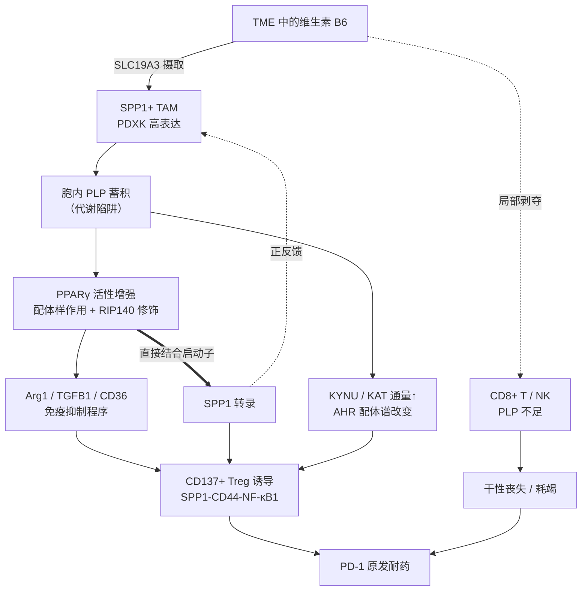

# 维生素 B6 区室化代谢重编程驱动 SPP1⁺ 巨噬细胞免疫抑制表型及 NSCLC 免疫治疗原发耐药的机制研究

> 本文档为基于文献检索整合而成的课题思路草案。文中引证来自公开文献的摘要与正文片段，核心结论建议在正式撰写标书前调阅原文核实图表细节。

## 文献检索的三个关键发现

**第一，原假说缺失的一环已有直接证据。** PPARγ 不只是被 PLP 调控，它还能直接结合 SPP1 启动子并激活转录——2026 年 JHEP Reports 的 CD36–PPARγ–SPP1 研究用 ChIP-qPCR 在脂质相关巨噬细胞中定位到 SPP1 启动子上的两个 PPARγ 结合位点，敲低 PPARγ 后 SPP1 表达被显著抑制。据此可将假说从单向链条升级为正反馈自维持环路。

**第二，存在一个必须正面处理的文献矛盾。** 2025 年 Developmental Cell 的工作显示 PLP 通过抑制 p70S6K、保护 BACH2 来维持 CD8⁺ T 细胞干性，补充维生素 B6 反而增强抗 PD-1 疗效；另有研究显示 PDXK 低表达的 NSCLC 预后更差。即"维生素 B6 = 免疫抑制"这一直觉与主流文献方向相反。

**第三，需要注意查重。** 2026 年 Cancers 一篇 CRC 生信文章已报道 SPP1⁺ TAM 富集维生素 B6 代谢通路，并推测 PDXK 参与免疫抑制。"SPP1⁺ 巨噬细胞 B6 代谢旺盛"这一观察本身已不新，创新必须落在机制与因果验证上。

---

## 一、立项依据

免疫检查点抑制剂已成为晚期 NSCLC 的一线选择，但约 50%–60% 的患者呈现原发耐药。多项单细胞与空间转录组研究一致指向 SPP1⁺ 髓系细胞：2026 年 *Scientific Reports* 一项纳入 197 例 LUAD 患者（79 例应答、118 例耐药）的研究发现 SPP1⁺ 髓系亚群特异性富集于耐药肿瘤并空间聚集于癌巢周围；*npj Precision Oncology* 的多组学研究进一步显示无应答者中 SPP1 信号显著增强，并通过 SPP1–CD44 与 SPP1–ITGA4/ITGB1 与 T/NK 细胞通信，阻断 SPP1 可恢复 CD8⁺ T 细胞功能并降低 M2 极化。然而，SPP1⁺ 巨噬细胞这一表型如何被建立并稳定维持、其上游代谢驱动力仍不清楚，这正是本课题的切入点。

前期工作在 NSCLC 免疫治疗无应答患者中发现 SPP1⁺ 巨噬细胞显著富集，KEGG 富集提示其维生素 B6 代谢通路异常活跃，SCENIC 预测 PPARG 转录活性升高。结合以下文献链条，认为二者之间存在因果联系。

### 链条一：PLP 增强 PPARγ 转录活性

Yanaka 等（*Exp Ther Med*, 2011）证实 PLP 可诱导 3T3-L1 细胞 PPARγ 靶基因（aP2、Gyk）表达，并在 PPARγ 转染的 NIH3T3 中促进脂质蓄积，首次提出维生素 B6 是 PPARγ 的激活因子；Moreno-Navarrete 等（*Diabetologia*, 2016）证实 PLP 是生理性脂肪生成所必需，且 PPARγ 激动剂可上调 PDXK，提示二者间存在前馈调节。分子层面，Huq 等（*Nat Chem Biol*, 2007）发现 PLP 可与核受体共抑制因子 RIP140 的 Lys613 形成席夫碱共价加合，改变其核内滞留与阻遏活性——这为"PLP 无需作为高亲和力配体即可重塑 PPARγ 转录输出"提供了机制解释。

### 链条二：PPARγ 是巨噬细胞免疫抑制程序的主控因子，并直接转录 SPP1

Arg1、Ym1、Fizz1 的 5′ 侧翼区含有 PPRE，GW9662 可阻断其诱导；PPARγ 还通过招募 p300/RAD21 以非配体依赖方式维持 STAT6 可及的染色质结构。更关键的是，CD36–PPARγ–SPP1 轴研究证实 PPARγ 直接结合 SPP1 启动子驱动其分泌。这提示 PLP → PPARγ → SPP1 → 更强的脂质/信号输入 → PPARγ 构成自我强化环路，可解释 SPP1⁺ 表型的"表观锁定"现象。

需注意方向性存在语境依赖：早期研究（Oyama 等，*Circ Res* 2002；*J Atheroscler Thromb* 2000）显示曲格列酮在 THP-1 中经 A/T 富集序列抑制骨桥蛋白表达，与上述激活方向相反。脂质负载的 LAM 语境更接近 SPP1⁺ TAM 生物学。

### 链条三：SPP1⁺ 巨噬细胞经多条通路诱导并招募 Treg

*Gut* 最新研究（gutjnl-2025-337038）阐明 SPP1⁺ 巨噬细胞通过 SPP1–CD44–NF-κB1 轴直接结合 TNFRSF9 启动子，驱动 Treg 分化为高抑制性 CD137⁺ 亚群，LNP-siSPP1 联合 anti-CD44 单抗可协同逆转；此外 SPP1⁺ TAM 是 TGF-β1、IL-10、PD-L1 与 Arg1 的主要来源，并可经 IL4I1–AHR 轴招募 Treg。

### 链条四（本课题提出的新桥梁）：PLP 依赖的犬尿氨酸通路

犬尿氨酸酶（KYNU）与犬尿氨酸转氨酶（KAT）均为 PLP 依赖酶，胞内 PLP 水平直接决定色氨酸分解代谢的通量与产物谱，而 Kyn–AHR 轴是公认的 Treg 诱导与 ICI 耐药机制（*Nat Commun*, 2020；*J Immunol*, 2010）。该桥梁为 B6 代谢与 Treg 提供了第二条、且不依赖 PPARγ 的因果路径。

---

## 二、关键科学问题与核心假说

**科学问题**：SPP1⁺ 巨噬细胞如何通过区室化的维生素 B6 代谢重编程建立并自我维持免疫抑制表型，进而经 Treg 轴导致 NSCLC 对 PD-1 阻断的原发耐药？

**核心假说（区室化 B6 争夺模型）**：NSCLC 中 SPP1⁺ 巨噬细胞高表达 PDXK 与 B6 转运体，将摄取的 B6 迅速磷酸化为带电、不可自由跨膜的 PLP 而形成"代谢陷阱"，由此产生方向相反的双重效应——胞内 PLP 蓄积增强 PPARγ 转录活性、经 PPARγ 直接转录 SPP1 形成正反馈环路以锁定免疫抑制表型；同时造成微环境局部 B6 剥夺，使 CD8⁺ T 与 NK 细胞因 PLP 不足而丧失干性、走向耗竭。二者叠加，并经 SPP1–CD44–NF-κB1 与 PLP 依赖的 Kyn–AHR 通路共同诱导 CD137⁺ Treg，最终形成 PD-1 原发耐药。

该模型的价值在于，它把"补充 B6 增强抗肿瘤免疫"与"B6 代谢亢进导致免疫抑制"这两个看似矛盾的结论统一为同一代谢物在不同细胞区室中的相反效应，并直接导出与众不同的治疗策略：干预目标不是全身增减维生素 B6，而是选择性阻断髓系细胞的 PDXK 或其 B6 摄取，实现微环境内 B6 的重新分配。

---

## 三、研究内容

### 内容一：临床关联与空间代谢定位

建立 NSCLC 免疫治疗队列（严格限定原发耐药，排除治疗后进展的获得性耐药），以多重免疫荧光/成像质谱流式验证 SPP1⁺PDXK⁺ 巨噬细胞丰度与疗效的关系；采用 MALDI 质谱成像直接观测 PLP 在 TAM 富集区与 T 细胞浸润区的空间分布梯度，为"区室化剥夺"提供直接证据（此为本课题最具说服力的原创性数据）。

### 内容二：PLP 增强 PPARγ 活性的分子机制

分选原代 SPP1⁺ TAM 并结合 THP-1/BMDM 模型，以靶向代谢组定量胞内 PLP；通过 PPRE 报告基因、PPARγ CUT&Tag 与 RNA-seq 判定 PLP 对 PPARγ 靶基因谱的重塑；用 PLP 亲和探针 pull-down 结合质谱鉴定 PLP 修饰的核蛋白，重点验证 RIP140 K613，并以 K613R 突变体判定该修饰的方向性与必要性。

### 内容三：PPARγ–SPP1 正反馈环路与 Treg 诱导

ChIP-qPCR 验证 PPARγ 在人 SPP1 启动子的富集及其对 PLP 的响应；建立 SPP1⁺ TAM 与自体 CD4⁺ T 细胞共培养体系，以流式检测 Foxp3⁺CD137⁺ Treg 比例，并用 anti-CD44、TNFRSF9 敲除、AHR 抑制剂 CH-223191 拆解 SPP1–CD44–NF-κB1 与 Kyn–AHR 两条通路的相对贡献。

### 内容四：干预验证与转化

构建髓系特异性 *Pdxk*^fl/fl^;*Lyz2*-Cre 小鼠，在 LLC/KP 肺癌模型中评估肿瘤生长、Treg 比例、CD8⁺ T 功能及对 anti-PD-1 的应答；以 PDXK 抑制剂（4-脱氧吡哆醇、天然产物 P57）与 PPARγ 拮抗剂 GW9662 进行药理学干预，验证联合 anti-PD-1 的增效作用；最终建立 SPP1/PDXK/PPARG 联合评分作为疗效预测标志物。

---

## 四、创新点

**科学概念创新**：首次提出肿瘤微环境中维生素 B6 的区室化争夺模型，将同一微量营养素在髓系与淋巴系中的相反作用统一于一个框架，破解现有文献的方向性矛盾。

**机制创新**：首次揭示 PLP–PPARγ–SPP1 正反馈环路是 SPP1⁺ 巨噬细胞表型自我维持的分子基础，回答了该亚群"为何一旦形成就难以逆转"这一悬而未决的问题。

**技术与转化创新**：以空间代谢组直接可视化肿瘤内辅酶梯度；提出髓系限定性 PDXK 抑制这一区别于全身营养干预的新策略。

---

## 五、主要风险与应对

**风险一：PLP 对 PPARγ 的作用可能较弱或为间接。** 原文献中 PLP 需 100 μM、48 小时方见效应，动力学明显慢于 TZD，提示为间接机制。因此表述上应定位为"内源性调节因子/转录活性增强子"而非高亲和力配体，考核指标锁定功能后果而非结合常数；同时并行推进 RIP140 共调节因子重编程与 Kyn–AHR 代谢流两条备选机制，任一成立课题即可闭合。

**风险二：PDXK 敲低的脱靶效应。** PLP 是逾百种酶的辅因子，敲低 PDXK 可能造成广泛代谢损伤而非特异表型。所有敲低实验必须设置 PLP 回补挽救组，并同步检测细胞活力与耗氧率，否则该缺陷在评审中难以通过。同理，GW9662 为不可逆抑制剂且存在脱靶，需与 *Pparg* 遗传学敲低互为印证。

**风险三：查重与增量创新的界定。** 鉴于 SPP1⁺ TAM 的 B6 代谢富集已在 CRC 中被报道，立项书中应主动引用该文并明确区分：既往为跨癌种的转录组推断性观察，本课题提供的是代谢物层面的直接测量、分子机制与体内因果验证。

---

## 六、关于原案中其他转录因子的处理建议

原案中的 TCF7L2 与 GPBP1L1 暂不纳入主线：前者在巨噬细胞中缺乏文献支撑（经典研究集中于 β 细胞、肠道 L 细胞与脂肪细胞），后者功能报道完全空白（仅有 DNA 结合、GC-rich 启动子结合的预测性注释），建议作为探索性内容放在附属位置，待预实验出现阳性结果后再决定是否深入。

---

## 主要参考文献

1. Yanaka N, et al. Vitamin B6 regulates mRNA expression of peroxisome proliferator-activated receptor-γ target genes. *Exp Ther Med*. 2011;2:419-424.
2. Moreno-Navarrete JM, et al. Metabolomics uncovers the role of adipose tissue PDXK in adipogenesis and systemic insulin sensitivity. *Diabetologia*. 2016. doi:10.1007/s00125-016-3863-1
3. Huq MD, et al. Vitamin B6 conjugation to nuclear corepressor RIP140 and its role in gene regulation. *Nat Chem Biol*. 2007;3:161-165.
4. CD36–PPARγ–SPP1 axis mediates hepatocyte–macrophage coordination to drive MASLD-related liver fibrosis. *JHEP Rep*. 2026. doi:10.1016/j.jhepr.2026.101745
5. Oyama Y, et al. PPARγ ligand inhibits osteopontin gene expression through interference with binding of nuclear factors to A/T-rich sequence in THP-1 cells. *Circ Res*. 2002. doi:10.1161/hh0302.105098
6. SPP1⁺ macrophages facilitate the differentiation and maturation of regulatory T cells in tumour-draining lymph nodes of colorectal cancer. *Gut*. doi:10.1136/gutjnl-2025-337038（PMID 42285754）
7. Zhang R, et al. SPP1-positive myeloid cell subpopulations associated with resistance to PD-1/L1 immunotherapy in lung adenocarcinoma. *Sci Rep*. 2026. doi:10.1038/s41598-026-57503-4
8. SPP1⁺ macrophages in tumor immunosuppression: mechanisms and therapeutic implications. *Front Immunol*. 2025;16:1711015.
9. SPP1⁺ Macrophages and the Orchestration of Spatially Organized Immunosuppression in Cancer. *Biomedicines*. 2026;14:294.
10. Vitamin B6 preserves the stemness-like phenotypes and antitumor ability of CD8⁺ T cells. *Dev Cell*. 2025. S1534-5807(25)00691-4
11. Vitamin B6 Competition in the Tumor Microenvironment Hampers Antitumor Functions of NK Cells. PMC10784745.
12. Opitz CA, et al. Blockade of the AHR restricts a Treg-macrophage suppressive axis induced by L-Kynurenine. *Nat Commun*. 2020;11:4011. doi:10.1038/s41467-020-17750-z
13. Mezrich JD, et al. An interaction between kynurenine and the aryl hydrocarbon receptor can generate regulatory T cells. *J Immunol*. 2010.（PMID 20720200）
14. PPARgamma in Metabolism, Immunity, and Cancer: Unified and Diverse Mechanisms of Action. *Front Endocrinol*. 2021;12:624112.
15. Procyanidin B2 Activates PPARγ to Induce M2 Polarization in Mouse Macrophages. *Front Immunol*. 2019;10:1895.
16. Integrated Single-Cell and Spatial Transcriptomic Analysis Identifies Putative Metabolic Crosstalk Between SPP1⁺ TAMs and SLC6A20⁺ Epithelial Cells in Colorectal Cancer. *Cancers*. 2026;18:1755.
17. Mishra, et al. Multifaceted role of the vitamin B6 pathway in cancer. *Genes Dev*. 2025. doi:10.1101/gad.352770.125
18. pH-dependent pyridoxine transport by SLC19A2 and SLC19A3. *J Biol Chem*. 2020. doi:10.1074/jbc.ra120.013610
19. Substrate transport and drug interaction of human thiamine transporters SLC19A2/A3. *Nat Commun*. 2024. doi:10.1038/s41467-024-55359-8
20. Natural product P57 induces hypothermia through targeting pyridoxal kinase.
